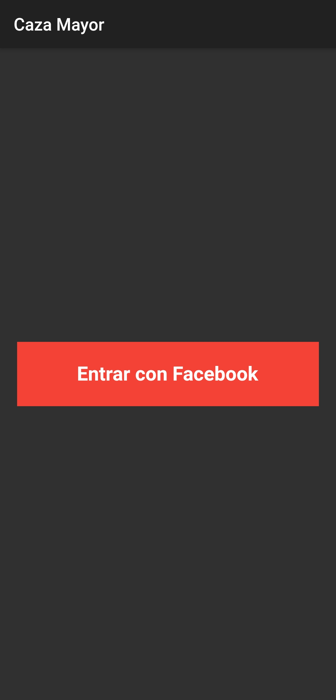
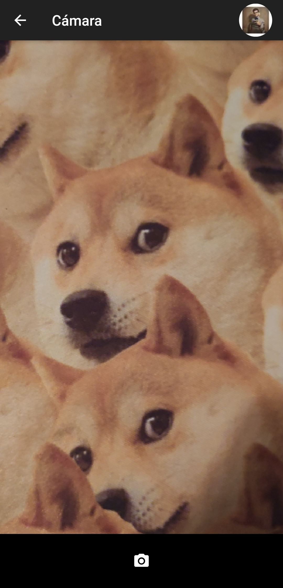
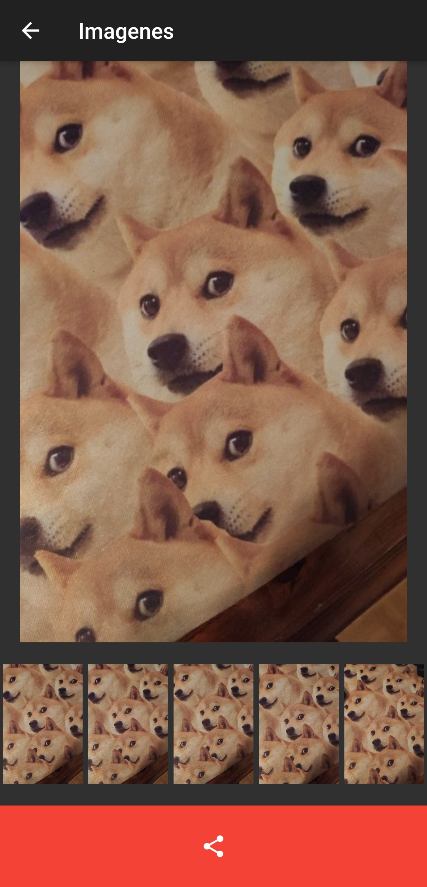
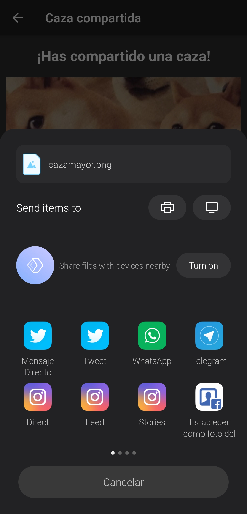
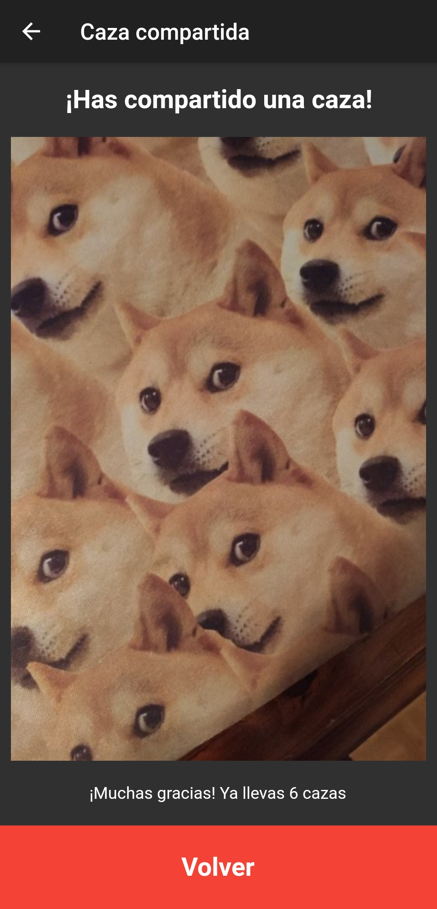
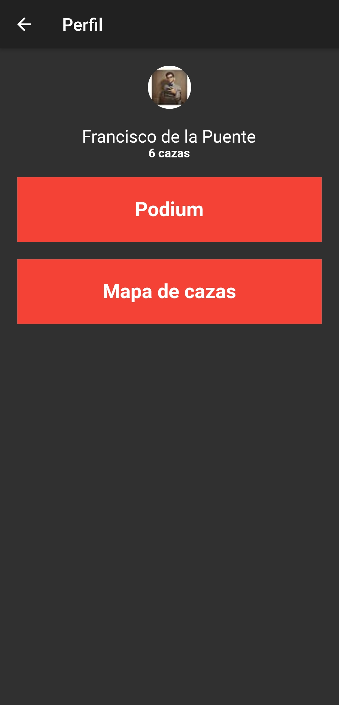
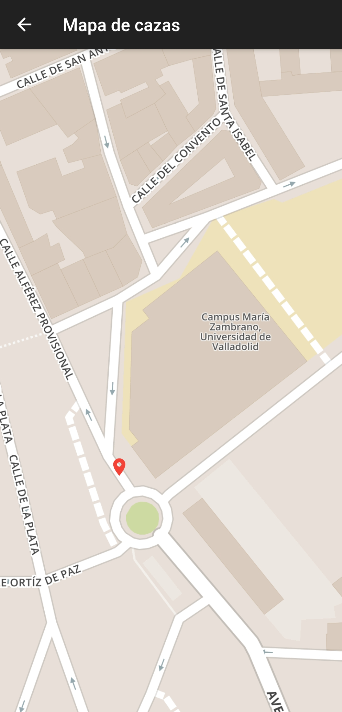
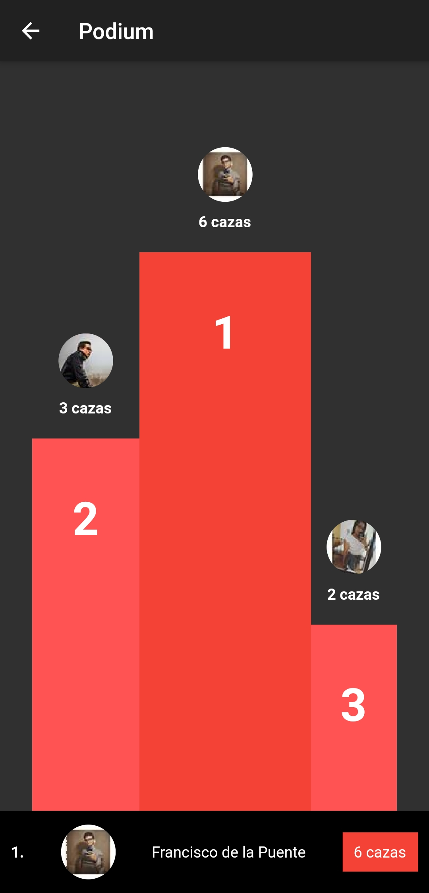

# Caza Mayor

**Práctica final Plataformas de Software Móviles** - Guillermo Centeno y Francisco de la Puente

## Índice

1. [Descripción](#1)
2. [Implementación](#2)
3. [Funcionalidades](#3)
    - [Splashscreen](#4)
    - [Autenticación](#5)
    - [Cámara y galería](#6)
    - [GPS](#7)
    - [Publicación en redes](#8)
    - [Estadística](#9)
    - [Mapa](#10)
    - [Podium](#11)
4. [Capturas de pantalla](#12)

## 1. Descripción

Con está aplicación puedes hacer fotografías a perros cuyos dueños no están cumpliendo la normativa que se les aplica. Estas fotografías se podrán compartir a través de distintas redes sociales, mencionando automáticamente la ubicación donde ocurre y etiquetandolo con la ciudad donde se produce, para que otros usuarios puedan encontrarlo fácilmente.

## 2. Implementación

El desarrollo de la aplicación se ha basado en su totalidad en Flutter, un lenguaje que aporta comodidad a la hora de desarrollar debido a características como el Hot Reload, y que permite la creación simultanea de una aplicación para Android y para iOS con el mismo código.

En cuanto a las funcionalidades que se piden en el enunciado de la práctica, todas han sido incluidas a excepción de la versión iOS, la cual no podíamos realizar dado que no disponemos de un ordenador firmado por Apple. Por lo tanto, están son todas las funcionalidades que encontramos:

- Icono y splashscreen
- El usuario se autentica usando el servicio de Firebase
- La aplicación permite sacar una secuencia de fotos (cada 3 segundos) y seleccionar la mejor
- Se leen las coordenadas GPS, con las que se recupera la dirección
- Publicación en redes sociales
- Asignar puntos y llevar una estadística con Firebase Database
- Mapa donde se muestran todas las cazas
- Podium de mayores cazadores, además de posición personal en el ranking

## 3. Funcionalidades

A continuación se detallan las distintas funcionalidades mencionadas anteriormente.

### Splashscreen

Hay diferentes formas de implementar una splashscreen. En el caso de esta aplicación, está hecho de forma que la splashscreen es la pantalla que se muestra mientras se carga la aplicación (hay otras formas que solo añaden una pantalla anterior a la inicial, pero es mostrada después de la carga de la aplicación).

Para esto solo había que modificar el archivo *launch_background.xml*, encontrado en la carpeta de recursos de la aplicación. Se muestra una pantalla negra con el icono de la aplicación.

### Autenticación

Se ha implementado la autenticación mediante Firebase. Esta es realizada a través de Facebook, debido a que el planteamiento inicial era que la publicación de las cazas fuera exclusivamente en Facebook, aunque finalmente se cambió de idea (en el apartado de Publicación en redes se explica por qué).

Se tuvo que registrar la aplicación en Facebook, añadir distintos elementos en el *AndroidManifest* y usar una librería específica para Facebook (*flutter_facebook_login*), además de la librería de Firebase (*firebase_auth*).

### Cámara y galería

Para la implementación de la cámara, seguimos la [documentación oficial de Flutter](https://flutter.dev/docs/cookbook/plugins/picture-using-camera). La secuencia de fotografías y la galería es de invención propia, siguiendo los conocimientos que se han adquirido en la asignatura y personalmente.

En este caso, se usan las librerías *camera*, para el uso de la cámara, *path_provider* y *path*, para guardar las fotografías en un directorio temporal.

### GPS

Cuando se realiza una fotografía, la ubicación donde se ha realizado se guarda. En caso de compartir la fotografía en redes sociales, de esa ubicación se obtendrá la ciudad y calle para compartir la ubicación de una forma amigable.

Para esto se utiliza la librería *geolocator*, que se encarga tanto de capturar la ubicación como de traducirla a una dirección corriente.

### Publicación en redes

Como se ha dicho antes, la idea inicial fue que la publicación de fotografías se realizara exclusivamente en Facebook. Recientemente Facebook prohibió rellenar la información a compartir por parte de la aplicación ([sección 2.3](https://developers.facebook.com/policy/#control)), por lo que solamente se podía publicar la fotografía.

Por ello se decidió cambiar la forma de compartir de la aplicación, encontrando una librería (*esys_flutter_share*) que permite compartir tanto la imagen como el texto en cualquier red social. Por lo contado anteriormente, si se intenta publicar en Facebook no se rellena el texto. Aun así, esta librería permite compartir sin ningún problema en otras redes sociales como Twitter, WhatsApp, Telegram...

### Estadística

Se ha usado Firebase Database para guardar las cazas de cada usuario y, así, poder llevar una estadística de quién ha realizado más, además de poder mostrar los puntos donde se hicieron en un mapa, como será explicado en los últimos apartados.

Se ha usado para esto la librería *cloud_firestore*, en la que se identifican los usuarios por el ID de Facebook, y donde se guardan la imagen de perfil, el nombre y las ubicaciones de todas las cazas.

### Mapa

Dentro del perfil del usuario (al que se accede mediante su foto de perfil en la pantalla de la cámara) se encuentran dos opciones. Una de ellas es un "Mapa de cazas". Esta nueva pantalla muestra un mapa con las ubicaciones de las distintas cazas realizadas por el usuario.

La librería usada para representar el mapa es *flutter_map*, que permite mostrar el mapa y añadirle distintos marcadores, con los que se señalan las ubicaciones de las cazas. En el enunciado de la práctica se recomendaba el uso de OpenStreetMaps, pero esta aplicación usa [Mapbox](https://www.mapbox.com/), dado que tiene un mejor rendimiento y es igualmente gratis.

### Podium

La otra opción que se encuentra en el perfil es la del "Podium". Es la forma que tiene la aplicación de mostrar los datos guardados en Firebase Database. En esta pantalla, se muestran el número de cazas de los usuarios que más han acumulado, además de su foto de perfil para su identificación. A mayores, en la parte inferior de la pantalla se muestra la situación del usuario: su posición en el ranking, su imagen de perfil, nombre y número de cazas.

Para esto no se ha necesitado ninguna librería nueva, aunque hace uso de *cloud_firestore* para recuperar los datos de los usuarios de la base de datos.

## 4. Capturas de pantalla

> Captura 1. Pantalla de inicio de sesión

> Captura 2. Pantalla de cámara

> Captura 3. Pantalla de galería

> Captura 4. Publicación

> Captura 5. Pantalla de resumen

> Captura 6. Perfil

> Captura 7. Pantalla de mapa de cazas

> Captura 8. Pantalla de podium